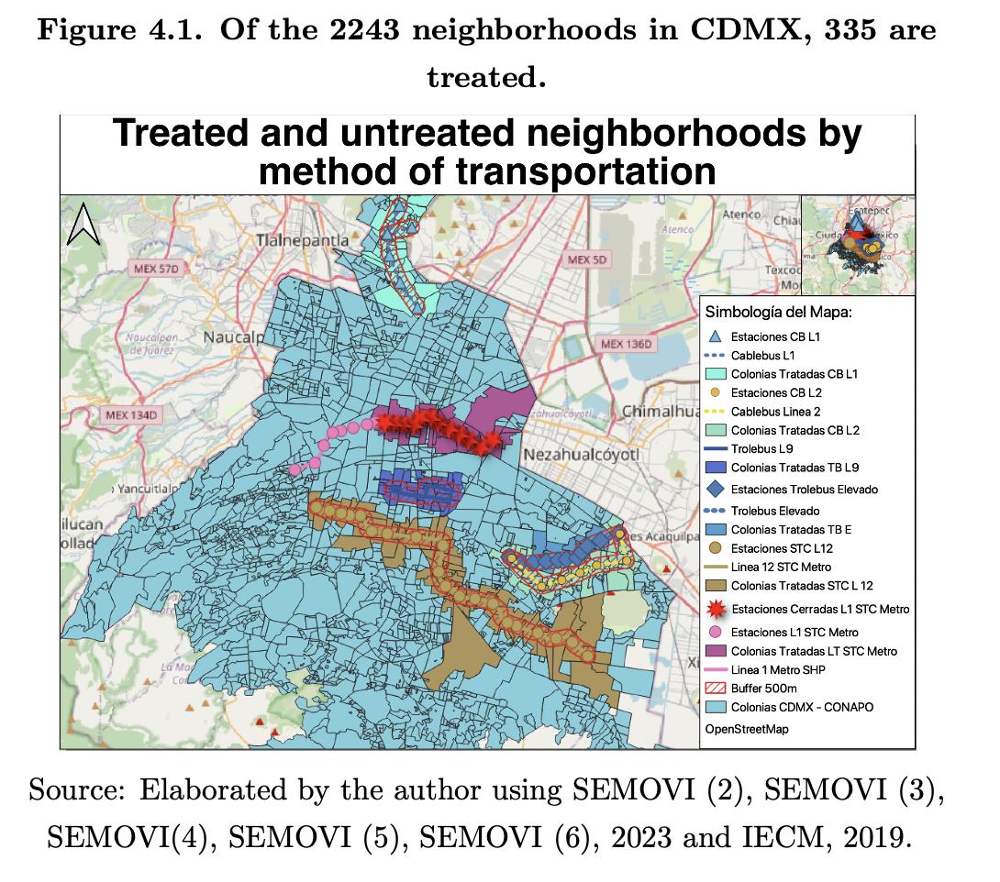
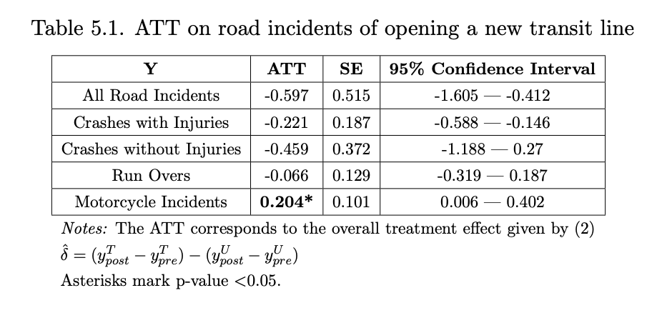
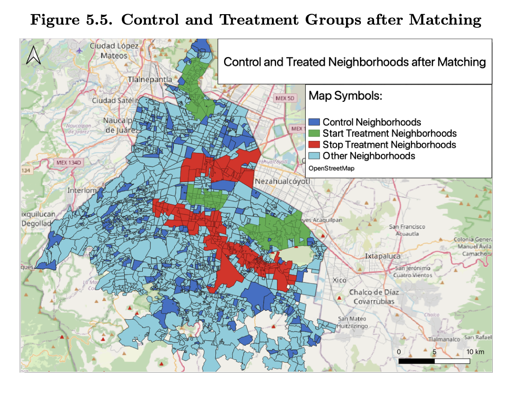
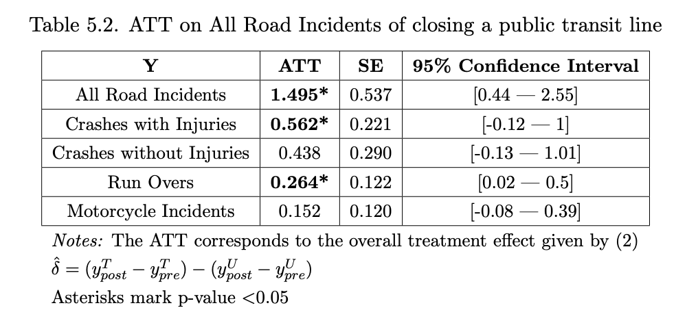

# Tesis de Economía
En este github ecnontrarás todos los scripts requeridos para recrear los resultados del did de movilidad de mi tesis!
Los resultados son interesantes al mostrar un efecto en los incidentes viales cuando se cierra una línea de transporte público i.e. STC Metro Líneas 1 y 12.

Los resultados más relevantes siendo:
* 20.5% overall road incident increase on a line closure.
* 15.5% decrease on overall road incidents when a new lines opens when using a matching design.
* 11.1% increase of road incidents on a stop using a matching design.

This work adds to the existing literature on public transit externalities.

Algo de lo que podrás recrear con este código: 

Resultados con Control Completo
	

Resultados con control haciendo uso de matching:

Para ello los inputs, que son algo pesados, son los siguientes:

* [Incidentes Viales Reportados por el C5](https://datos.cdmx.gob.mx/dataset/groups/incidentes-viales-c5) - La última fecha utilizada fue al mes de Julio de Agosto de 2023.
* [Mapa de Colonias de CDMX](http://www.conapo.gob.mx/work/models/CONAPO/Marginacion/Datos_Abiertos/Colonia/imc2020_shp.zip) Utilizamos el mapa de colonias de la CONAPO. 

Adicionalmente utilizamos: 

* Metrobús Lines maps: https://datos.cdmx.gob.mx/dataset/geolocalizacion-metrobus
* Subway (Metro) Lines: https://datos.cdmx.gob.mx/dataset/lineas-y-estaciones-del-metro
* Cablebús L1: https://www.google.com/maps/d/viewer?mid=1oMdN93ldNzWajJd71Posa3kyrriFYfqM&femb=1&ll=19.527070428047303%2C-99.132169&z=13
* Cablebús L2: https://www.google.com/maps/d/viewer?mid=1K71K1Ies8kGq5Gq1AhkBhEVHD6wejGuC&femb=1&ll=19.343885217353048%2C-99.02604699999999&z=14
* Trolebús L9: https://www.ste.cdmx.gob.mx/linea-9](https://www.google.com/maps/d/viewer?mid=1pAQUGOTxXOEI1VhCpgXOAHRRi6z6dS15&femb=1&ll=19.389136040213213%2C-99.09273660000001&z=13
* Trolebús L10 (Elevado): https://www.google.com/maps/d/viewer?mid=1v0m4sq7XgP-UeJgLlal-W_M_y2cVTCs&femb=1&ll=19.35089294174388%2C-99.02892929999997&z=14
* Main Roads in Mexico City: https://datos.cdmx.gob.mx/dataset/vialidades-de-la-ciudad-de-mexico

Eso sería todo.

If you have any doubts on how to reproduce this you can contact me at david.ortega.alfaro@gmail.com :) - DAOA
